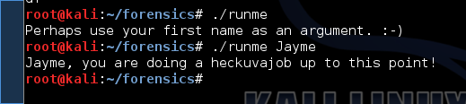
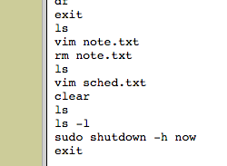

Jayme Woogerd and Guocui Gao   
Comp 116 - Security  
December 4, 2014  
Assignment 5 - Forensics  

###Part 1

First we noticed that images a.jpg and c.jpg were exactly the same size and, 
when `diff`ed, were identical. Therefore, we suspected that image b.jpg
was the one with something embedded in it. We wrote a short Python script that
brute-forced the extraction using a supplied wordlist and the command `steghide
extract -sf b.jpg -p {password}`. The password ended up being "disney" from the
Kali Linux-supplied wordlist `directories.jbrofuzz`. Running the `file` command
on the extracted result showed that file was an executable. Finally we 
`chmod`ed the file so that it could be executed and executed it...the results 
are below.

###Part 2
1. Disk formats: Win95 FAT32 and Linux  

2. There doesn't appear to be a phone carrier involved -- that is, there is 
no evidence that this device is a phone. It appears that there are two 
partitions, one is just a Windows-formatted file system. The other appears to 
be a real computer or virtual machine, complete with a full Linux 
distribution installed on it.

3. Operating system: Kali Linux 1.0.9. To find this information, we looked in 
the `/etc` directory for "release" files and found a file named
`/etc/debian_version`, which contained information about the operating system.

4. Given that there is a full Kali Linux distribution installed, there are the
normal executables that ship with Linux in `\bin` and `\usr\bin`, etc -- these
are programs like `bash`, `grep`, etc. You can also see the Kali included 
applications like Ice Weasel and Wireshark in `/usr/share/applications`.

5. Yes, there is a root user, password "princess". We found this by using John
the Ripper to crack the user and password lists in `/etc/passwrd` and 
`/etc/shadow`, respectively.

6. Yes, there are additional user accounts:
        alejandro:
        judas:     00000000
        stefani:   iloveyou

7. Aside from having creepy images, videos, and notes about upcoming shows... 

8. The suspect deleted three photos from the `alejandro` account. From the 
bash history log of the user `stefani`, you can see that the suspect also
deleted a file called `note.txt`.  There are also many, many deleted packages.  

9. Yes, the suspect did save photos of the celebrity: under the `alejandro`
user account there are seventeen JPEG photos saved. Of these, the suspect
deleted three. 

10. Yes, we found the file `/home/root/lockbox.txt`, which is an encrypted zip 
archive file and not a text file as the file extension suggests. We guessed a 
few times and found the right password: gaga. Inside the archive is a file named 
`edge.mp4`, which is a video of one of Lady Gaga's performances.

11. It appears the suspect wanted to see the celebrity at some upcoming shows:   
        12/31/2014: The Chelsea at the Cosmopolitan of Las Vegas Las Vegas, NV 9:00 p.m. PST  
        2/8/2015: Wiltern Theatre, Los Angeles, CA, 9:30 p.m. PST  
        5/30/2015: Hollywood Bowl, Hollywood, CA, 7:30 p.m. PDT  
We found this information in a file called `/home/stefani/sched.txt`.
12. The celebrity is Lady Gaga (Real name: Stefani Joanne Angelina Germanotta).
